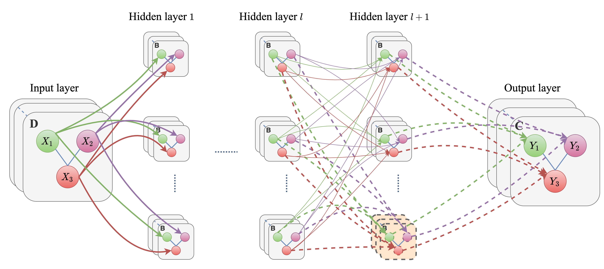

# PGCN

<div align="left">
  <a 
    
  </a>
  <sup>*</sup>
</div>

PyTorch implementation of Progressive Graph Convolutional Networks for Semi-Supervised Node Classification method [1].
This work is an extension of GCN method [2], which finds an optimized network GCN architecture for semi-supervised node classification.




The preprocessed Citeseer, Cora and Pubmed datasets can be found in ./pgcn/data directory. 


## Installation

```python setup.py install```

## Requirements

  * PyTorch 0.4 or 0.5
  * Python 2.7 or 3.6


## Running the code

```git clone https://github.com/negarhdr/PGCN```

```python setup.py install```

```cd pgcn```

```python pgcn.py --dataset cora --blocksize 5 --epochs 200```

You can specify different values for the model's hyper-parameters such as blocksize, number of epochs, dataset name, etc. 


## References


[1] [Heidari & Iosifidis, Progressive Graph Convolutional Networks for Semi-Supervised Node Classification, 2020](https://arxiv.org/pdf/2003.12277.pdf)

[2] [Kipf & Welling, Semi-Supervised Classification with Graph Convolutional Networks, 2016](https://arxiv.org/abs/1609.02907)


## Acknowledgement

This repo is modified based on [PyGCN](https://github.com/tkipf/pygcn).

## Cite

Please cite our paper if you use this code in your work:

```
@article{heidari2020progressive,
  title={Progressive graph convolutional networks for semi-supervised node classification},
  author={Heidari, Negar and Iosifidis, Alexandros},
  journal={arXiv preprint arXiv:2003.12277},
  year={2020}
}
```
